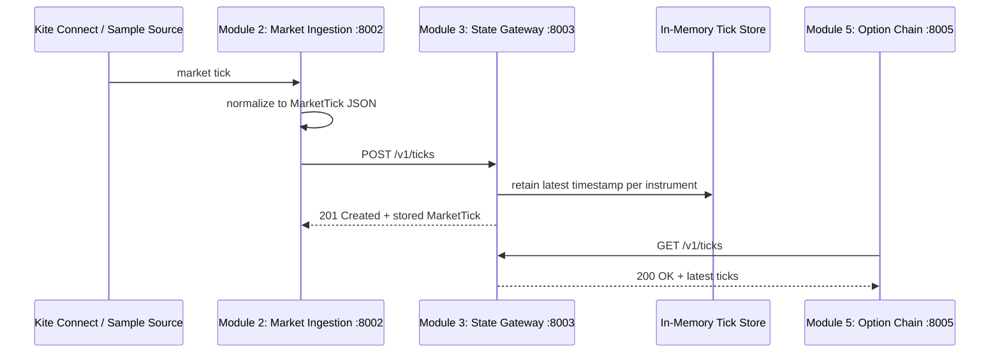

# Module 2 and Module 3 Communication Flow

## Services

| Module | Service | Base URL | Responsibility |
|---|---|---|---|
| 2 | Market Ingestion | `http://127.0.0.1:8002` | Gets normalized option ticks from sample data now and Kite Connect later. |
| 3 | State Gateway | `http://127.0.0.1:8003` | Stores the newest tick per instrument in memory for the live session. |

## Connected Flow



## API Contract

### Module 2 output

`MarketTick` JSON is the shared message. Module 2 will send the same data shape that its
`GET /v1/ticks` endpoint returns.

```json
{
  "instrument": "NFO:NIFTY26SEP24800CE",
  "index": "NIFTY 50",
  "strike": 24800.0,
  "expiry": "2026-09-04",
  "option_type": "CE",
  "bid": 132.45,
  "ask": 133.2,
  "ltp": 132.7,
  "oi": 25000000,
  "volume": 2170000,
  "iv": 12.8,
  "timestamp": "2026-08-29T10:30:00+00:00"
}
```

### Module 3 input

| Method | URL | Request body | Response |
|---|---|---|---|
| `POST` | `http://127.0.0.1:8003/v1/ticks` | One `MarketTick` JSON object | `201 Created` and the stored current tick. |

### Module 3 output

| Method | URL | Response |
|---|---|---|
| `GET` | `http://127.0.0.1:8003/v1/ticks` | `200 OK` and all current ticks. |
| `GET` | `http://127.0.0.1:8003/v1/ticks/{instrument}` | `200 OK` and the current tick, or `404`. |

## Current Status

Both services run independently and their APIs are verified. The automatic Module 2 `POST` to
Module 3 is the next integration change; currently Module 2 only exposes its sample ticks and
Module 3 accepts ticks posted by a client.

## Manual End-to-End Check

Start both services in separate terminals, then run:

```powershell
$ticks = Invoke-RestMethod http://127.0.0.1:8002/v1/ticks
$tick = $ticks[0]
$body = $tick | ConvertTo-Json
Invoke-RestMethod -Method Post -Uri http://127.0.0.1:8003/v1/ticks -ContentType 'application/json' -Body $body
Invoke-RestMethod http://127.0.0.1:8003/v1/ticks
```
