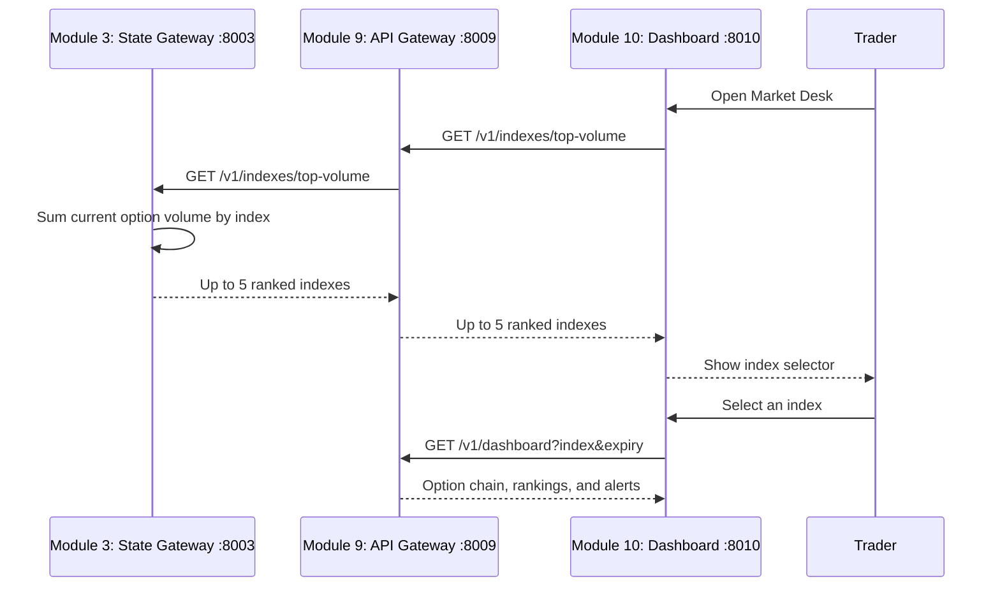

# Modules 3, 9, and 10 Index Selection Flow

| Service | Endpoint | Responsibility |
|---|---|---|
| State Gateway | `GET /v1/indexes/top-volume` | Aggregates current CE/PE tick volume per index and returns at most five. |
| API Gateway | `GET /v1/indexes/top-volume` | Proxies the State Gateway ranking to the browser-facing API. |
| Dashboard | Gateway request on page load | Renders the selector and reloads desk data after index selection. |

This is an intraday observed-volume ranking. It shows only indexes currently ingested by Module 2
and retained in Module 3. It is not the separate 20-year historical liquidity ranking.
