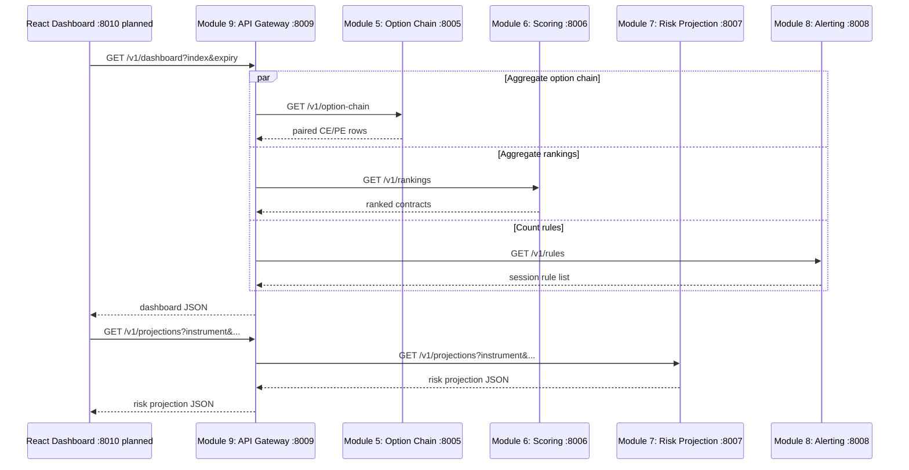

# Modules 5, 6, 7, 8, and 9 Communication Flow

Module 9 aggregates data at request time and does not persist it. The Dashboard service is the
next module and will only call API Gateway, never the internal services directly.
