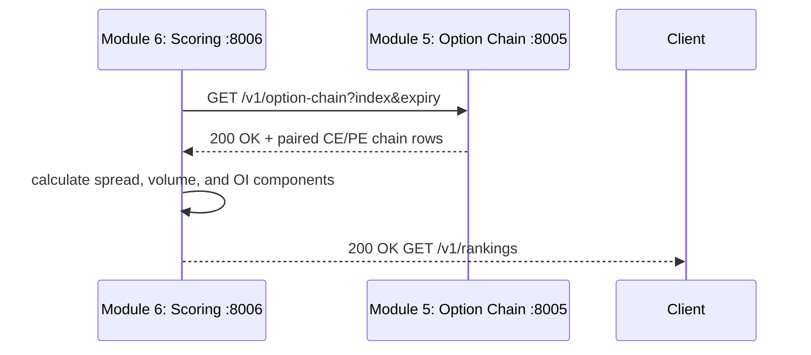

# Module 5 and Module 6 Communication Flow

| Direction | Method | Endpoint | Payload |
|---|---|---|---|
| Module 6 → Module 5 | `GET` | `/v1/option-chain?index={index}&expiry={expiry}` | Paired CE/PE rows by strike. |
| Client → Module 6 | `GET` | `/v1/rankings?index={index}&expiry={expiry}` | Ranked contracts with explainable score components. |

The live score uses spread (40 points), volume (30 points), and open interest (30 points).
