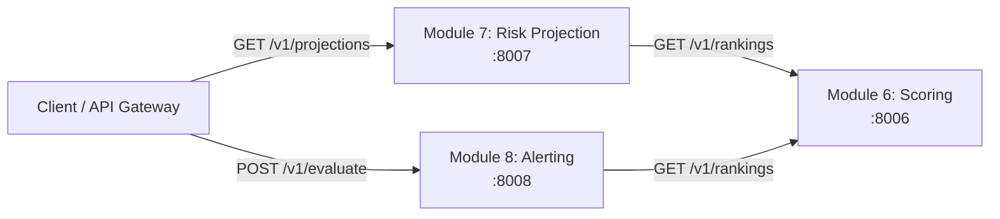

# Module 6, Module 7, and Module 8 Communication Flow

| Consumer | Upstream call | Result |
|---|---|---|
| Module 7 | `GET :8006/v1/rankings?index&expiry` | Finds the selected contract and computes payoff/risk in option points. |
| Module 8 | `GET :8006/v1/rankings?index&expiry` | Evaluates session-only score/spread alert rules. |

Module 7 does not claim profit or return rupee values. Module 8 applies per-rule/per-instrument cooldowns.
