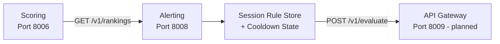

# Alerting Service Diagram

```mermaid
flowchart LR
    Score["Scoring\nPort 8006"]
    Alert["Alerting\nPort 8008"]
    Rules["Session Rule Store\n+ Cooldown State"]
    Api["API Gateway\nPort 8009 - planned"]

    Score -->|GET /v1/rankings| Alert
    Alert --> Rules
    Rules -->|POST /v1/evaluate| Api
```

The MVP evaluates alerts on request. It will evaluate on live score events after event streaming
is introduced.
