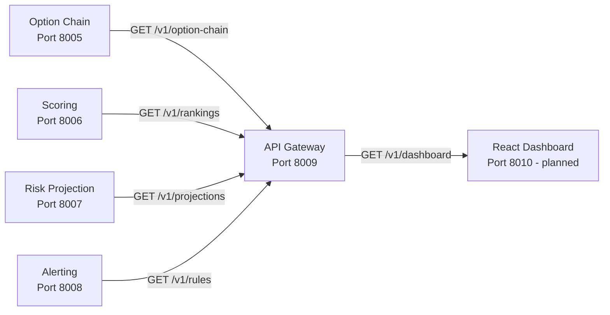

# API Gateway Service Diagram

```mermaid
flowchart LR
    Chain["Option Chain\nPort 8005"]
    Score["Scoring\nPort 8006"]
    Risk["Risk Projection\nPort 8007"]
    Alert["Alerting\nPort 8008"]
    Gateway["API Gateway\nPort 8009"]
    Dashboard["React Dashboard\nPort 8010 - planned"]

    Chain -->|GET /v1/option-chain| Gateway
    Score -->|GET /v1/rankings| Gateway
    Risk -->|GET /v1/projections| Gateway
    Alert -->|GET /v1/rules| Gateway
    Gateway -->|GET /v1/dashboard| Dashboard
```

The gateway aggregates current results without a database. CORS accepts only the configured Dashboard origin.
