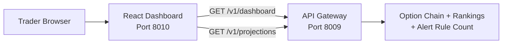

# Dashboard Service Diagram

```mermaid
flowchart LR
    Browser["Trader Browser"]
    Dashboard["React Dashboard\nPort 8010"]
    Gateway["API Gateway\nPort 8009"]
    Data["Option Chain + Rankings\n+ Alert Rule Count"]

    Browser --> Dashboard
    Dashboard -->|GET /v1/dashboard| Gateway
    Dashboard -->|GET /v1/projections| Gateway
    Gateway --> Data
```

The Dashboard only calls API Gateway. It uses sample data locally when the gateway cannot be reached.
