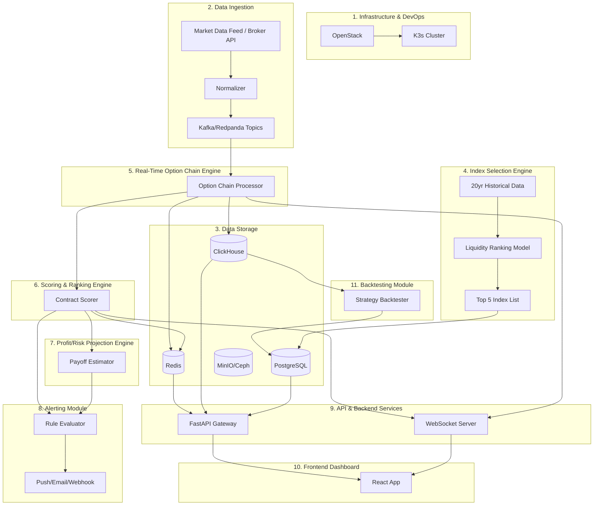
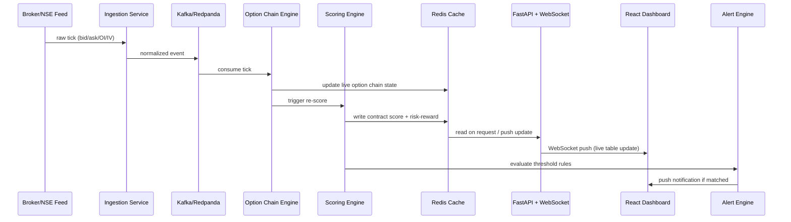

# System Architecture & Data Flow

## Module relationship diagram

## End-to-end data flow (live tick to user alert)

## Notes
- Modules 4 (Index Selection) and 11 (Backtesting) are analytics-only and decoupled
  from the live tick path so they can be developed/tested independently.
- Scoring and Profit/Risk modules are explicitly decision-support outputs, not trade
  signals or profit guarantees.
