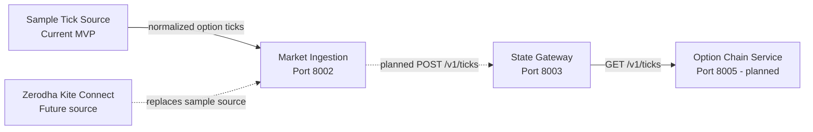

# Market Ingestion Service Diagram

## Service Boundary



## Interfaces

| Endpoint | Purpose |
|---|---|
| `GET /health` | Confirms that the service is running. |
| `GET /v1/ticks` | Returns normalized sample CE/PE option ticks. |

The next integration sends each normalized `MarketTick` to State Gateway using
`POST http://127.0.0.1:8003/v1/ticks`.

See `API.md` for request/response schemas, examples, status codes, and compatibility rules.

## Local Run

```powershell
Set-Location d:\Databricks\options-trading-app\market-ingestion
.\start.ps1
```

The service is independently runnable on `http://127.0.0.1:8002`.
