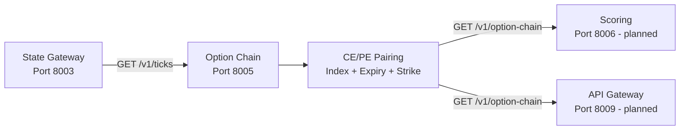

# Option Chain Service Diagram

```mermaid
flowchart LR
    State["State Gateway\nPort 8003"]
    Chain["Option Chain\nPort 8005"]
    Pair["CE/PE Pairing\nIndex + Expiry + Strike"]
    Score["Scoring\nPort 8006 - planned"]
    Api["API Gateway\nPort 8009 - planned"]

    State -->|GET /v1/ticks| Chain
    Chain --> Pair
    Pair -->|GET /v1/option-chain| Score
    Pair -->|GET /v1/option-chain| Api
```

The service stores no data. It rebuilds each requested chain from State Gateway's current
in-memory ticks.
