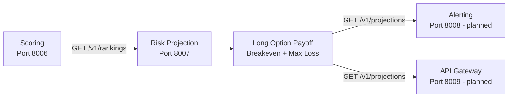

# Risk Projection Service Diagram

```mermaid
flowchart LR
    Score["Scoring\nPort 8006"]
    Risk["Risk Projection\nPort 8007"]
    Model["Long Option Payoff\nBreakeven + Max Loss"]
    Alert["Alerting\nPort 8008 - planned"]
    Api["API Gateway\nPort 8009 - planned"]

    Score -->|GET /v1/rankings| Risk
    Risk --> Model
    Model -->|GET /v1/projections| Alert
    Model -->|GET /v1/projections| Api
```

The service stores no data. It computes a projection when requested from current Scoring output.
