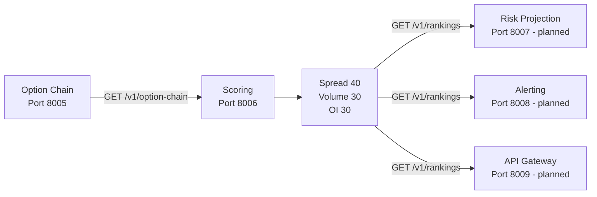

# Scoring Service Diagram

```mermaid
flowchart LR
    Chain["Option Chain\nPort 8005"]
    Scoring["Scoring\nPort 8006"]
    Formula["Spread 40\nVolume 30\nOI 30"]
    Risk["Risk Projection\nPort 8007 - planned"]
    Alert["Alerting\nPort 8008 - planned"]
    Api["API Gateway\nPort 8009 - planned"]

    Chain -->|GET /v1/option-chain| Scoring
    Scoring --> Formula
    Formula -->|GET /v1/rankings| Risk
    Formula -->|GET /v1/rankings| Alert
    Formula -->|GET /v1/rankings| Api
```

The service does not store scores in the MVP. It calculates them from the Option Chain response
for each rankings request.
