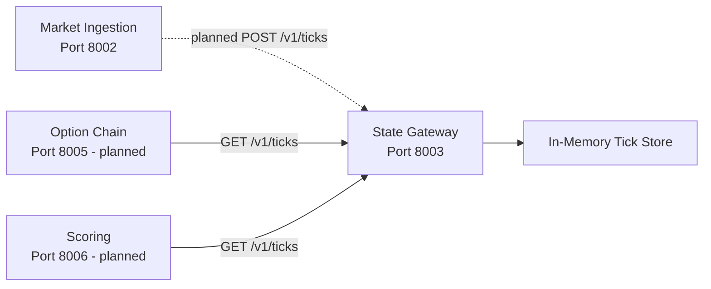

# State Gateway Service Diagram

The store is process-local for the MVP. Redis is an optional replacement when state must be
shared across service replicas or restored after restart. The automatic ingestion-to-gateway
post is the next integration change.
